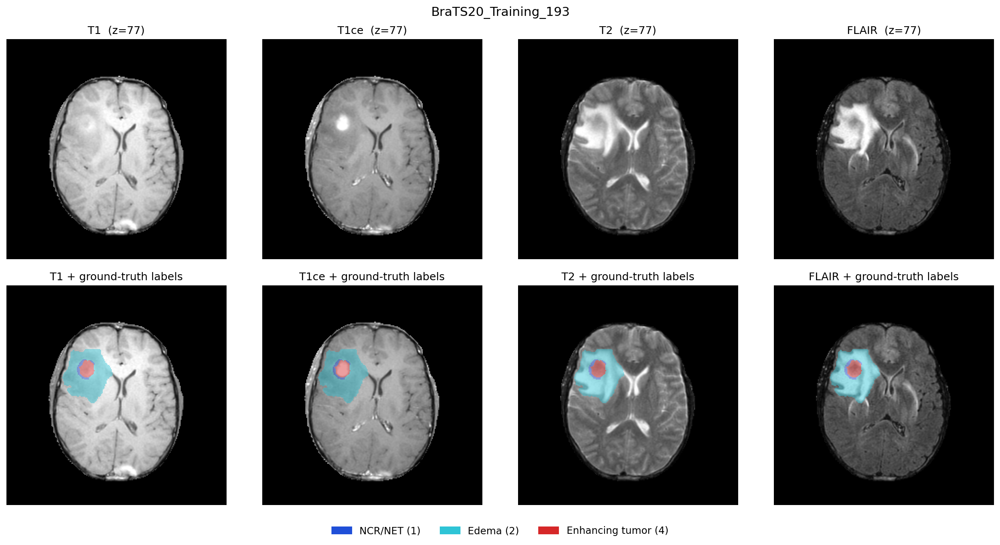
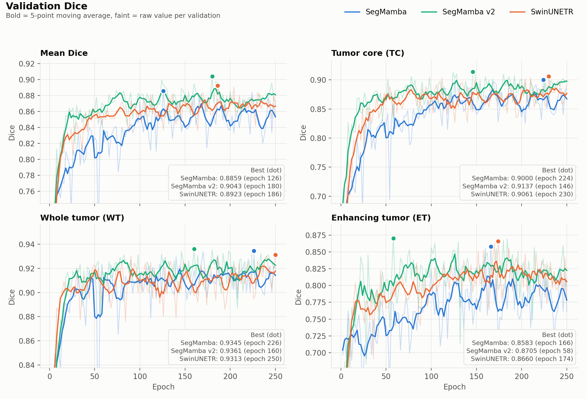

# SegMamba, SegMamba v2 and SwinUNETR on BraTS 2020 (Sep 30)

All three models were trained on BraTS 2020 with the same data split (70/10/20, seed 42):

- **SegMamba**: original training recipe, [3_train.py](../../3_train.py).
- **SegMamba v2**: same SegMamba backbone, inference and split, with a fixed training recipe ([segmamba_v2/](../../segmamba_v2/)). See [What changed in SegMamba v2](#what-changed-in-segmamba-v2) below.
- **SwinUNETR**: the codebase in [swinunetr/](../../swinunetr/).

### What changed in SegMamba v2

The network backbone is unchanged (`model_segmamba/segmamba.py`). The data, split, patch size, augmentation and inference are also the same as the original run ([3_train.py](../../3_train.py) / [4_predict.py](../../4_predict.py)). The changes are listed in [segmamba_v2/config.py](../../segmamba_v2/config.py):

| # | Change | Original SegMamba | SegMamba v2 | Why it matters |
|---|---|---|---|---|
| 1 | LR schedule finishes | SGD 1e-2, poly decay over **1000** epochs but stopped at 266, so the LR was still ≈ 7.6e-3 at the end | SGD 1e-2, poly decay over **250** epochs, so the LR reaches 0 | Without the low-LR phase at the end, the weights keep bouncing around. This matches the noisy validation curve of the original SegMamba. |
| 2 | Loss | 4-class cross entropy | BCE + soft Dice (batch Dice) | The Dice term optimizes overlap directly and isn't dominated by the large background, which helps the small ET and TC regions. |
| 3 | Output | 4-class softmax (background, 1, 2, 4) | 3 sigmoid channels (TC, WT, ET), with ET ⊂ TC ⊂ WT enforced after thresholding at 0.5 | The model predicts the evaluated regions directly instead of deriving them from the label map. This is the nnU-Net region setup. |
| 4 | Deep supervision | none | extra 1×1×1 heads at 1/2, 1/4 and 1/8 resolution (weights 1, ½, ¼, ⅛, normalized) | Gives the decoder's lower levels a direct training signal. It adds only 1×1×1 convolutions, so memory is about the same. |
| 5 | ET post-processing | none | small ET components are removed, and ET below a volume threshold is relabelled as necrosis. The thresholds are tuned on the validation split ([postprocess.py](../../segmamba_v2/postprocess.py)). | Targets false-positive ET in cases with little or no enhancing tumor, which otherwise get HD95 = 50. |
| 6 | `--seed` option | fixed seeds | same seeds by default; `--seed N` shifts them for repeat runs | Doesn't change this result. It makes the 2–3 seed repeats recommended in [section 4](#4-final-decision) possible. |

Changes 1–5 were all made at once and there was no ablation, so this report can't say how much each one contributes to the improvement in [section 3](#3-test-set-results).

Each model is scored on three tumor regions:

- **WT (whole tumor)**: all tumor labels (1, 2, 4).
- **TC (tumor core)**: necrotic core and enhancing tumor (1, 4).
- **ET (enhancing tumor)**: enhancing tumor only (4).

| | SegMamba | SegMamba v2 | SwinUNETR |
|---|---|---|---|
| Epochs trained | 266 | 250 | 250 |
| Validation | every 2nd epoch, 36 cases | every 2nd epoch, 36 cases | every 2nd epoch, 36 cases |
| Best validation mean Dice | 0.8859 (epoch 126) | **0.9043 (epoch 180)** | 0.8923 (epoch 186) |
| Test set | 73 cases | 73 cases | 73 cases |

Epochs are counted from 1, as in [Figure 2](#2-validation-dice-curves).

Files in this folder:

- `train_metrics_segmamba_sep30.csv`, `train_metrics_segmamba_v2_oct1.csv`, `train_metrics_swinunetr_sep30.csv`: training loss and validation mean Dice for each epoch.
- `final_comparison_result_sep30.csv`: test-set metrics for SegMamba and SwinUNETR. The SegMamba v2 test metrics are only in [section 3](#3-test-set-results).
- `all_models_dice_curves_oct1.png`: validation Dice curves for all three models ([Figure 2](#2-validation-dice-curves)).

---

## 1. Sample BraTS case

**What it shows:** the middle axial slice (z = 77) of case `BraTS20_Training_193` in all four MRI scans. The top row shows the raw T1, T1ce, T2 and FLAIR images. The bottom row overlays the same **ground-truth** labels on each scan. The figure was made with [visualize_brats.py](../../visualize_brats.py) and does not show a prediction from either model.

The four scans are aligned to the same voxel grid, so one label map fits all of them. Both models take all four scans as a 4-channel input, because each scan shows a different part of the tumor.

**The four scans:**

| Scan | What it shows in this case | Region it helps with |
|---|---|---|
| **T1** | Mostly normal anatomy. The tumor area is only slightly brighter than the surrounding tissue, and the edema can hardly be seen. | Mainly a reference for anatomy |
| **T1ce** (T1 with contrast agent) | The enhancing tumor is a sharp, very bright blob, because the contrast agent leaks where the blood–brain barrier is broken. It is the only scan where this blob stands out clearly. | **ET** and **TC** |
| **T2** | Edema and fluid are bright. The whole abnormal area is visible, but so are the ventricles (normal fluid), which are just as bright. | **WT** |
| **FLAIR** | Like T2, but the signal from normal fluid is suppressed, so the ventricles are dark and only the edema stays bright. The tumor's full extent is easiest to see here. | **WT** |

**How to read the overlay:**

- The large **cyan** area is peritumoral edema (label 2). It matches the bright region on T2 and FLAIR. Edema makes up most of the whole-tumor (WT) region, so WT is the largest and easiest region to segment.
- The small **red** blob is enhancing tumor (label 4), the ET region. It sits exactly on the bright spot in T1ce.
- The thin **blue** rim is necrotic / non-enhancing core (label 1). Together with the red blob it makes up the tumor core (TC).

This case shows why the metrics behave as they do. ET and TC are small structures inside a much larger WT region, and they are clearly visible on only one of the four scans (T1ce). A few misplaced voxels change their Dice a lot, so ET and TC scores are lower and vary more between cases than WT scores. WT is supported by two scans (T2 and FLAIR).

---

## 2. Validation Dice curves

**What it shows:** Dice on the 36 validation cases, measured every 2nd epoch, for mean Dice, (TC + WT + ET) / 3, and for each region. Faint lines are the raw values and bold lines are a 5-point moving average. Dots mark each model's best epoch, which is the checkpoint used for testing.

**Observations:**

- **SegMamba v2 learns fastest and stays highest.** Its smoothed mean Dice reaches about 0.86 by epoch 20 and stays above the other two models for most of training, mostly between 0.86 and 0.89. SwinUNETR is in the middle and the original SegMamba is lowest.
- **Best mean Dice:** SegMamba v2 0.9043 (epoch 180), SwinUNETR 0.8923 (epoch 186), SegMamba 0.8859 (epoch 126).
- **ET shows the biggest gap.** SegMamba v2 and SwinUNETR sit around 0.80–0.83, while the original SegMamba stays around 0.75–0.80 for most of training. The fixed recipe mainly helps on the smallest, hardest region.
- **TC:** SegMamba v2 leads early. After about epoch 150, SegMamba v2 and SwinUNETR are close, and the original SegMamba catches up near the end.
- **WT:** all three models are within about 0.90–0.93 after epoch 50. SegMamba v2 is slightly highest.
- **Stability:** the original SegMamba is the noisiest, with sharp drops (for example near epoch 53). SegMamba v2 and SwinUNETR are smoother.
- **Caveat:** the original SegMamba training log for epochs 0–43 was lost. Its early values come from a reconstruction, so don't draw conclusions from the blue curve before about epoch 44.

---

## 3. Test-set results

Evaluated on 73 held-out test cases. Values are mean ± std across cases. The best value in each row is in bold.

| Metric    | SegMamba         | SegMamba v2          | SwinUNETR            |
|-----------|------------------|----------------------|----------------------|
| Dice TC   | 0.8229 ± 0.213   | **0.8595 ± 0.169**   | 0.8523 ± 0.187       |
| Dice WT   | 0.9094 ± 0.062   | **0.9198 ± 0.052**   | 0.9162 ± 0.061       |
| Dice ET   | 0.7022 ± 0.312   | 0.7260 ± 0.302       | **0.7356 ± 0.293**   |
| Dice Mean | 0.8115 ± 0.164   | **0.8351 ± 0.144**   | 0.8347 ± 0.149       |
| HD95 TC   | 7.1864 ± 10.847  | **5.0458 ± 7.201**   | 6.1905 ± 9.815       |
| HD95 WT   | 5.9301 ± 9.413   | **5.4081 ± 8.595**   | 5.4779 ± 7.914       |
| HD95 ET   | 10.8785 ± 17.296 | 9.2075 ± 15.773      | **7.9415 ± 14.100**  |
| HD95 Mean | 7.9983 ± 9.644   | 6.5538 ± 7.172       | **6.5366 ± 7.529**   |

Dice: higher is better. HD95 (mm): lower is better. Cases where the prediction or the ground truth is empty get HD95 = 50.

### 3a. Difference from SwinUNETR

Each SegMamba model is compared with SwinUNETR, the reference model. Δ = model − SwinUNETR, so a positive Δ is better for Dice and a negative Δ is better for HD95. The p-values come from a paired Wilcoxon signed-rank test; **bold** means p < 0.05.

| Metric    | SegMamba Δ  | SegMamba p    | Better    | SegMamba v2 Δ | SegMamba v2 p | Better      |
|-----------|-------------|---------------|-----------|---------------|---------------|-------------|
| Dice TC   | −0.0294     | **2.4e-05**   | SwinUNETR | +0.0072       | 0.25          | SegMamba v2 |
| Dice WT   | −0.0068     | **0.0032**    | SwinUNETR | +0.0036       | 0.55          | SegMamba v2 |
| Dice ET   | −0.0334     | **5.6e-05**   | SwinUNETR | −0.0096       | 0.58          | SwinUNETR   |
| Dice Mean | −0.0232     | **5.0e-07**   | SwinUNETR | +0.0004       | 0.49          | SegMamba v2 |
| HD95 TC   | +0.9959 mm  | **0.0045**    | SwinUNETR | −1.1447 mm    | 0.40          | SegMamba v2 |
| HD95 WT   | +0.4522 mm  | 0.31          | SwinUNETR | −0.0698 mm    | 0.99          | SegMamba v2 |
| HD95 ET   | +2.9370 mm  | **0.012**     | SwinUNETR | +1.2660 mm    | 0.074         | SwinUNETR   |
| HD95 Mean | +1.4617 mm  | **0.0034**    | SwinUNETR | +0.0172 mm    | 0.85          | SwinUNETR   |

- **Original SegMamba vs SwinUNETR:** SwinUNETR is better on all 8 metrics, and 7 of the 8 differences are significant. The largest gaps are on ET (−3.3 Dice points, +2.9 mm HD95) and TC (−2.9 Dice points).
- **SegMamba v2 vs SwinUNETR:** none of the 8 differences is significant. Mean Dice is 0.8351 vs 0.8347 and mean HD95 is 6.55 mm vs 6.54 mm. SegMamba v2 is slightly ahead on TC and WT, and SwinUNETR is slightly ahead on ET. ET HD95 is the only metric close to significance (p = 0.074).
- **SegMamba v2 vs original SegMamba:** v2 is better on all 8 metrics. Mean Dice rises from 0.8115 to 0.8351 (+2.4 points) and mean HD95 falls from 8.00 mm to 6.55 mm. ET Dice improves by 2.4 points and TC Dice by 3.7 points. No paired test was run between the two SegMamba models.
- All models have large standard deviations on ET and TC, so performance varies a lot from case to case. Part of this comes from the HD95 = 50 penalty for empty predictions or empty ground truth.

---

## 4. Final decision

**SegMamba v2 and SwinUNETR perform the same on this BraTS 2020 setup. Both are clearly better than the original SegMamba.**

- **Test set:** SegMamba v2 and SwinUNETR are tied. None of the 8 differences is significant, and the mean Dice gap is 0.0004. SegMamba v2 has the best value on 5 of 8 metrics (TC, WT, mean Dice), and SwinUNETR on 3 (both ET metrics and mean HD95).
- **The gap was the training recipe, not the architecture.** The original SegMamba lost to SwinUNETR on 7 of 8 metrics with significant differences. SegMamba v2 uses the same backbone and changes only the training recipe, and that gap disappears. The likely main cause is change 1 in [What changed in SegMamba v2](#what-changed-in-segmamba-v2): the original LR schedule ran over 1000 epochs but training stopped at 266, so the learning rate never decayed. Changes 2–5 (Dice loss, region outputs, deep supervision, ET post-processing) probably also help, especially on ET and TC. There was no ablation, so the contribution of each change isn't measured.
- **Validation:** SegMamba v2 has the highest best validation mean Dice (0.9043 vs 0.8923 for SwinUNETR) and leads for most of training. Its validation lead (about 1 Dice point) does not carry over to the test set, so treat it as noise from the small 36-case validation set and checkpoint selection.
- **Remaining difference:** SwinUNETR is still slightly better on ET (+1.0 Dice point, −1.3 mm HD95), but this isn't significant.

**Recommendation:** drop the original SegMamba recipe and use SegMamba v2 in its place. Between SegMamba v2 and SwinUNETR, the accuracy results don't pick a winner. Choose on other factors, such as memory use and inference speed, which these experiments don't measure. To separate them on accuracy, repeat training with 2–3 seeds (`segmamba_v2/train.py --seed N`).

**Limitations to keep in mind:**

- Each model was trained once (single seed). With differences this small between SegMamba v2 and SwinUNETR, run-to-run variance could flip the ranking on any metric.
- The original SegMamba training log for epochs 0–43 was lost, so its early curves are estimates. This doesn't affect the test results or the best checkpoints.
- The original SegMamba trained for 266 epochs, and SegMamba v2 and SwinUNETR for 250. The curves had flattened well before the end, so this shouldn't change the ranking.
- SegMamba v2's ET post-processing was tuned on the validation set, the same set used to pick its best checkpoint.
