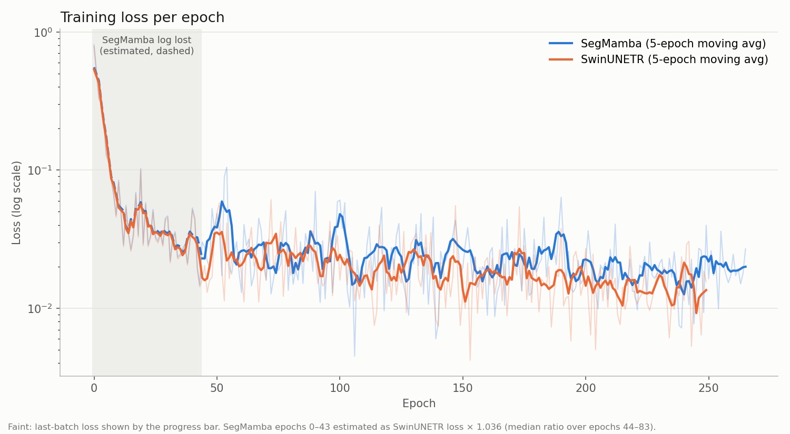
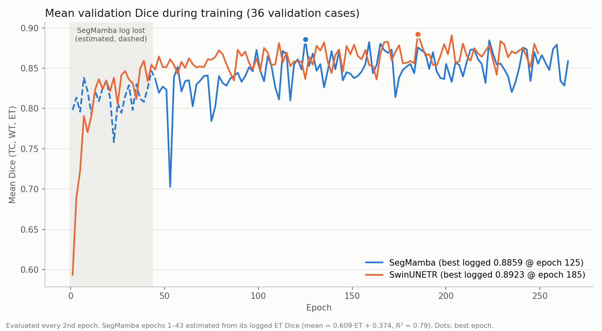

# SegMamba vs SwinUNETR on BraTS 2020 (Sep 30)

Both models were trained on BraTS 2020 with the same data split and the same training pipeline ([3_train.py](../../3_train.py) and the SwinUNETR codebase in [swinunetr/](../../swinunetr/)). Each model is scored on three tumor regions:

- **WT (whole tumor)**: all tumor labels (1, 2, 4).
- **TC (tumor core)**: necrotic core and enhancing tumor (1, 4).
- **ET (enhancing tumor)**: enhancing tumor only (4).

| | SegMamba | SwinUNETR |
|---|---|---|
| Epochs trained | 266 (0–265) | 250 (0–249) |
| Validation | every 2nd epoch, 36 cases | every 2nd epoch, 36 cases |
| Best validation mean Dice | 0.8859 (epoch 125) | 0.8923 (epoch 185) |
| Final validation mean Dice | 0.8587 (epoch 265) | 0.8684 (epoch 249) |
| Final train loss (last batch) | 0.0269 | 0.0156 |
| Test set | 73 cases | 73 cases |

Files in this folder:

- `train_metrics_segmamba_sep30.csv`, `train_metrics_swinunetr_sep30.csv`: training loss and validation mean Dice for each epoch.
- `final_comparison_result_sep30.csv`: test-set metrics (the table in [Figure 3](#3-test-set-results)).

---

## 1. Sample BraTS case


**What it shows:** the middle axial slice (z = 77) of case `BraTS20_Training_193` in all four MRI scans. The top row shows the raw T1, T1ce, T2 and FLAIR images. The bottom row overlays the same **ground-truth** labels on each scan. The figure was made with [visualize_brats.py](../../visualize_brats.py) and does not show a prediction from either model.

The four scans are aligned to the same voxel grid, so one label map fits all of them. Both models take all four scans as a 4-channel input, because each scan shows a different part of the tumor.

**The four scans:**

| Scan | What it shows in this case | Region it helps with |
|---|---|---|
| **T1** | Mostly normal anatomy. The tumor area is only slightly brighter than the surrounding tissue, and the edema can hardly be seen. | Mainly a reference for anatomy |
| **T1ce** (T1 with contrast agent) | The enhancing tumor is a sharp, very bright blob, because the contrast agent leaks where the blood–brain barrier is broken. It is the only scan where this blob stands out clearly. | **ET** and **TC** |
| **T2** | Edema and fluid are bright. The whole abnormal area is visible, but so are the ventricles (normal fluid), which are just as bright. | **WT** |
| **FLAIR** | Like T2, but the signal from normal fluid is suppressed, so the ventricles are dark and only the edema stays bright. The tumor's full extent is easiest to see here. | **WT** |

**How to read the overlay:**

- The large **cyan** area is peritumoral edema (label 2). It matches the bright region on T2 and FLAIR. Edema makes up most of the whole-tumor (WT) region, so WT is the largest and easiest region to segment.
- The small **red** blob is enhancing tumor (label 4), the ET region. It sits exactly on the bright spot in T1ce.
- The thin **blue** rim is necrotic / non-enhancing core (label 1). Together with the red blob it makes up the tumor core (TC).

This case shows why the metrics behave as they do. ET and TC are small structures inside a much larger WT region, and they are clearly visible on only one of the four scans (T1ce). A few misplaced voxels change their Dice a lot, so ET and TC scores are lower and vary more between cases than WT scores. WT is supported by two scans (T2 and FLAIR).

---

## 2. Training curves

### 2a. Training loss



**What it shows:** training loss for each epoch on a log scale. The faint lines are the raw values. Each raw value is the loss of the **last batch** in the epoch, as shown on the tqdm progress bar, not an average over the epoch. The bold lines are a 5-epoch moving average.

**Observations:**

- Both models converge at almost the same rate. Loss falls from about 0.5 to about 0.03 within the first 30 epochs.
- After about epoch 50, SwinUNETR's smoothed loss stays slightly below SegMamba's, at roughly 0.013–0.02 versus 0.02–0.03. So SwinUNETR fits the training data a little better.
- SegMamba's loss has a few larger bumps, around epochs 50, 100 and 190. These line up with dips in its validation Dice in Figure 2b, which suggests its training is less stable.
- **Caveat:** the SegMamba log for epochs 0–43 was lost (grey shaded area, dashed). Those values are **estimated** as SwinUNETR loss × 1.036, the median ratio between the two models over epochs 44–83. Don't draw conclusions from SegMamba's curve in that range.

### 2b. Validation mean Dice



**What it shows:** mean Dice, (TC + WT + ET) / 3, on the 36 validation cases. It was measured every 2nd epoch. Dots mark each model's best epoch, which is the checkpoint saved as `best_model_*.pt`.

**Observations:**

- SwinUNETR starts lower (0.59 at epoch 1). By about epoch 45 it has passed SegMamba, and it stays above SegMamba for most of the rest of training, mostly between 0.85 and 0.89.
- SegMamba's curve is noisier. It has sharp drops, down to 0.70 at epoch 53 and around 0.78–0.81 near epochs 77, 117 and 173. SwinUNETR's curve is smoother.
- Best checkpoints: **SwinUNETR 0.8923 at epoch 185** and **SegMamba 0.8859 at epoch 125**. The 0.006 gap is small, but it points the same way as the test results.
- Both curves flatten after about epoch 100. Training longer is unlikely to change the ranking.
- **Caveat:** SegMamba's values for epochs 1–43 (dashed) are **estimated** from its logged ET Dice with a linear fit (mean ≈ 0.609 · ET + 0.374, R² = 0.79). They were not measured directly.

---

## 3. Test-set results

Evaluated on 73 held-out test cases. Values are mean ± std across cases. The p-values come from a paired Wilcoxon signed-rank test.

```
metric                 segmamba           swinunetr   wilcoxon p
----------------------------------------------------------------
Dice TC          0.8229 ± 0.213      0.8523 ± 0.187    2.391e-05
Dice WT          0.9094 ± 0.062      0.9162 ± 0.061     0.003241
Dice ET          0.7022 ± 0.312      0.7356 ± 0.293    5.633e-05
Dice Mean        0.8115 ± 0.164      0.8347 ± 0.149    4.969e-07
HD95 TC          7.1864 ± 10.847     6.1905 ± 9.815     0.004478
HD95 WT          5.9301 ± 9.413      5.4779 ± 7.914       0.3096
HD95 ET         10.8785 ± 17.296     7.9415 ± 14.100     0.01231
HD95 Mean        7.9983 ± 9.644      6.5366 ± 7.529     0.003357
```

Dice: higher is better. HD95 (mm): lower is better. Cases where the prediction or the ground truth is empty get HD95 = 50.

| Metric    | Better    | Difference (SwinUNETR − SegMamba) | Significant (p < 0.05)? |
|-----------|-----------|-----------------------------------|-------------------------|
| Dice TC   | SwinUNETR | +0.0294                           | Yes (p = 2.4e-05)       |
| Dice WT   | SwinUNETR | +0.0068                           | Yes (p = 0.0032)        |
| Dice ET   | SwinUNETR | +0.0334                           | Yes (p = 5.6e-05)       |
| Dice Mean | SwinUNETR | +0.0232                           | Yes (p = 5.0e-07)       |
| HD95 TC   | SwinUNETR | −0.9959 mm                        | Yes (p = 0.0045)        |
| HD95 WT   | SwinUNETR | −0.4522 mm                        | No (p = 0.31)           |
| HD95 ET   | SwinUNETR | −2.9370 mm                        | Yes (p = 0.012)         |
| HD95 Mean | SwinUNETR | −1.4617 mm                        | Yes (p = 0.0034)        |

- The largest gains are on the harder sub-regions: enhancing tumor (ET: +3.3 Dice points, −2.9 mm HD95) and tumor core (TC: +2.9 Dice points).
- On whole tumor (WT) the two models are close. The Dice gap is small (+0.7 points), and the HD95 difference is not significant.
- Both models have large standard deviations on ET and TC, so performance varies a lot from case to case. Part of this comes from the HD95 = 50 penalty for empty predictions or empty ground truth.

---

## 4. Final decision

**SwinUNETR performs better than SegMamba on this BraTS 2020 setup.**

- **Test set:** SwinUNETR is better on all 8 metrics, and 7 of the 8 differences are statistically significant. Its mean Dice is 0.8347 versus 0.8115 (+2.3 points), and its mean HD95 is 6.54 mm versus 8.00 mm (−1.46 mm).
- **Clinically harder regions:** most of the advantage comes from ET and TC, the small regions that are hardest to segment. On WT, the easy region, the two models are close.
- **Training behaviour:** SwinUNETR reaches a lower training loss, a higher best validation Dice (0.8923 vs 0.8859) and a smoother validation curve. SegMamba shows more epoch-to-epoch instability.
- **Consistency:** validation and test results agree, so the ranking isn't an artefact of one data split.

**Recommendation:** use SwinUNETR as the primary model for this task. SegMamba is still competitive (within about 1 Dice point on WT). It may be worth revisiting if efficiency matters more, for example memory use or inference speed on larger volumes, but these experiments don't measure that.

**Limitations to keep in mind:**

- The SegMamba training log for epochs 0–43 was lost, so its early curves are estimates. This doesn't affect the test results or the best checkpoints.
- Each model was trained once (single seed). Part of the gap could be run-to-run variance. Repeating training with 2–3 seeds, or with cross-validation, would make the conclusion stronger.
- SegMamba trained for 266 epochs and SwinUNETR for 250. Both curves had flattened well before the end, so this difference shouldn't change the ranking.
